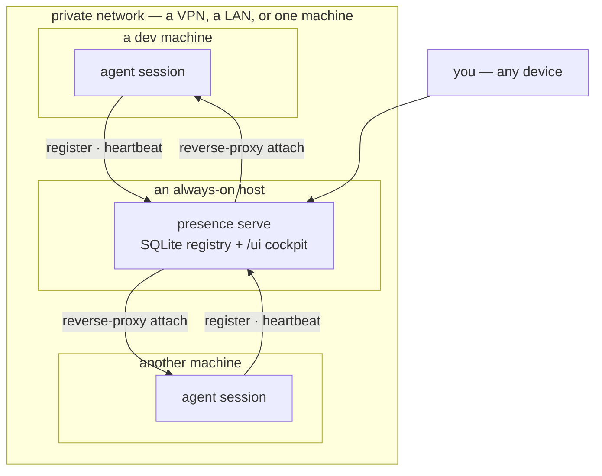
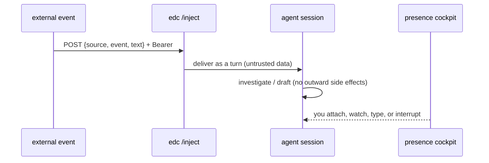

# Architecture

Plexus is two layers over one private network: **presence** (observe / control / launch) and **edc**
(inject). Each agent session sits in the middle — registered in presence, reachable by edc.

## Topology

- The **registry** runs on one always-on host. Every machine's agents register into it.
- The **cockpit** (`/ui`) and each session's **web terminal** are reachable from any device on the network.
- **edc** runs alongside each injectable session, exposing a local `/inject` endpoint.

None of it is fixed to a particular VPN, host type, or OS — see [Setup → Requirements](setup.md#requirements).
On a single machine the whole thing runs on `127.0.0.1`.

## How the two tools compose

| | **presence** | **edc** |
|---|---|---|
| Role | see, control, launch | feed events in as turns |
| Direction | you → session (observe/steer) | event → session (stimulus) |
| Surface | registry API, `/ui` cockpit, `plexus` launcher | `/inject` HTTP + per-agent adapters |
| Knows about the agent? | only its *kind* (a chip + a filter) | yes — one adapter per agent |

They meet at the **session**: edc injects a turn; presence lets you watch and steer that same session.

## An event's journey

## The registry row

Everything Plexus knows about a session is one row:

| Field | Meaning |
|---|---|
| `session_id` | stable id (the agent's own session id) |
| `host` | machine label (`laptop` / `server` / …) |
| `agent` | `claude` \| `codex` \| `opencode` |
| `repo` · `branch` · `repo_path` | what it's working on |
| `state` | `busy` \| `idle` \| `blocked` |
| `inject_port` | edc `/inject` port (`0` = visible but not injectable) |
| `attach_addr` | the session's web-terminal address, or empty |
| `started_at` · `last_seen` | timing; stale rows are pruned past the TTL |

State is deliberately small and self-cleaning: clients heartbeat, and the server prunes anything that goes
quiet past the TTL — a dead session drops off on its own.
