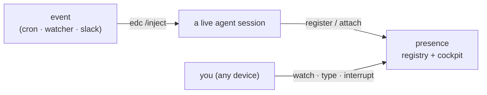

# Plexus

**One nervous system for your coding agents, across your machines.**

`plexus` is two small, self-hosted Go tools that work together:

- **[presence](presence.md)** — the *eyes and hands*. A session **registry**, a web **cockpit** with each
  session's live terminal, and a **launcher** for starting agents you can attach to from anywhere.
- **[edc](edc.md)** — the *input*. A uniform `/inject` endpoint that turns an external event (a cron, a
  watcher, a Slack message, another agent) into a **turn** inside a running session.

They're orthogonal and don't know each other's internals — they meet at the session. An event enters a
live session through **edc**; you watch that session work, type into it, or interrupt it through
**presence**.



## Two independent binaries

Plexus is two tools you can install and run **separately or together** — neither depends on the other:

| Binary | What it does | What it needs |
|---|---|---|
| **`presence`** (also `plexus`) | registry + cockpit + launcher — see, attach to, and launch sessions | a private address to bind; `tmux` + `ttyd` for the launcher/attach |
| **`edc`** | inject external events into a live session as turns | just the `edc` binary + a shared secret — no registry, no tmux |

Use **`presence` alone** to watch and launch agents; use **`edc` alone** to make a single session
event-driven; use **both** to get an injectable, attachable fleet. See [presence](presence.md) and
[edc](edc.md) for each.

## What it supports

| | |
|---|---|
| **Agents** | Claude Code, Codex, OpenCode — same registry, same inject contract |
| **Platforms** | macOS & Linux (Windows for `edc`); agents run wherever |
| **Machines** | one laptop, or many across a private network |
| **Injection** | external events → turns, per-agent adapters, with a trust boundary |
| **Attach** | a per-session web terminal (view, type, interrupt) behind one login |
| **Transport** | self-hosted; a private network + one shared token is the whole perimeter |

## The 60-second tour

```sh
# launch an agent in a tmux session you can reach from anywhere
plexus claude ~/code/api          # or: plexus codex … / plexus opencode …

# see the fleet
plexus ls                          # table of live sessions
plexus watch                       # live full-screen cockpit (TUI)

# the web cockpit (installable PWA)
open "$PRESENCE_URL/ui"          # sidebar of sessions + each one's live terminal

# wake a session with an external event
curl -X POST "http://127.0.0.1:$PORT/inject" \
  -H "Authorization: Bearer $SECRET" \
  -d '{"source":"cron","event":"nightly","text":"…"}'   # → a turn in that session
```

## Where to go next

- **[Architecture](architecture.md)** — how the two tools compose, and the topology.
- **[Agents](agents.md)** — what each agent supports and how it's wired.
- **[Setup & requirements](setup.md)** — from one laptop to many machines; what's actually required.
- **[Command reference](commands.md)** — every `plexus` / `presence` / `edc` verb.

!!! note "Design intent"
    `plexus` is built for a developer running a handful of long-lived agent sessions across machines they
    own. The **patterns** — an agent-agnostic registry, a uniform injection contract, and a strict trust
    boundary — generalize to any scale; the **implementation** (a shared token, a single-node SQLite
    registry, tmux-based attach) is a solo-to-small-team reference. See [Setup](setup.md#portability).
