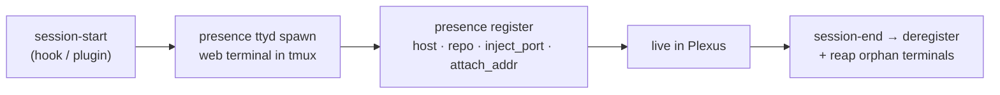

# presence

A single Go binary — installed as both `presence` and `plexus` — that plays three roles over one shared
SQLite registry. It is Plexus's *eyes and hands*: see every session, attach to it, launch new ones.

## Role 1 — Registry

`presence serve` runs the HTTP service on the always-on host (a private address or loopback only,
bearer-authed). It keeps one row per session and auto-prunes stale ones.

**Client verbs** (run from any machine, usually by hooks — not by hand):

| Verb | Does |
|---|---|
| `register` | upsert this session's row (host, repo, `inject_port`, `attach_addr`) |
| `heartbeat` | bump `last_seen` + set state (`busy` / `idle` / `blocked`) |
| `deregister` | remove the row |
| `list` / `ls` | list live sessions (`-o json` to script) |
| `get` | the freshest **injectable** session for a repo — the routing query |
| `watch` | a live full-screen cockpit in the terminal |
| `prune` | drop rows older than a duration |

`get` is the handoff primitive: `presence get --repo api --host laptop,server -o json` returns the freshest
session for a repo along with its inject port, so a router — or another agent — can deliver work
deterministically.

## Role 2 — Cockpit

`GET /ui` serves an installable PWA: a **sidebar** of live sessions (blocked-first, state-colored) and, on
the right, the **live terminal** of the selected session.

- **One login.** You paste the token once; it's stored as a cookie.
- **Attach without a second prompt.** Each session runs a per-session [`ttyd`](https://github.com/tsl0922/ttyd)
  web terminal. Presence **reverse-proxies** it at `/attach/<session_id>/`, injecting the terminal's own
  basic-auth — so you never see a second prompt and the terminal is never exposed raw on the network.
- **View, type, interrupt.** The embedded terminal is the real tmux session: type a turn, or send `esc` to
  interrupt — mirrored with whatever else is attached.
- **Mobile.** On a phone it's master → detail: tap a session, get its full-screen terminal, back to the list.

## Role 3 — Launcher (`plexus`)

`plexus` is the same binary. It starts an agent inside a **named tmux session** on a shared `plexus` socket, so
the session survives closing the terminal and is reachable from any machine.

```sh
plexus claude ~/code/api           # drop into an attachable claude session
plexus codex  ~/code/api           # same, for codex
plexus opencode ~/code/api         # decoupled stack — attachable AND injectable

plexus attach api                  # reattach (or click it in the cockpit)
plexus kill api                    # end the session
plexus ls                          # the fleet
```

- **`--detach`** creates the session headless (background / headless agents): `plexus claude --detach ~/x`.
- **Re-running `plexus claude <same dir>` reattaches** instead of starting a second agent.
- Sessions **persist** across a closed terminal; only exiting the agent or `plexus kill` ends them.

See [Command reference](commands.md) for every flag.

## How a session joins Plexus

Every agent goes through the **same two calls** — `presence ttyd spawn` (the web terminal) and
`presence register` — only *where* they're wired differs. That's what keeps the cockpit agent-agnostic.



- **Claude Code** — the hooks in the repo's `hooks/` (SessionStart / SessionEnd / keepalive).
- **Codex** — the `.codex-plugin` shipped by [edc](edc.md).
- **OpenCode** — the `.opencode-plugin` shipped by [edc](edc.md), on the `session.created` event.

A keepalive heartbeats idle sessions so they don't age out, and `attach_addr` is recovered from the
terminal's state file on any re-register — so a live, attachable session never looks dead in the cockpit.

## Security

- **Perimeter:** bind to a private address only — the server refuses `0.0.0.0`. Loopback for one machine,
  a VPN or LAN address for many.
- **Auth:** one shared token (`PRESENCE_TOKEN`), constant-time compared; the same token is the cockpit
  login and the terminal proxy credential.
- **Terminals** are never exposed directly — only through the authenticated `/attach` proxy.

This is a single-user / small-team model. For per-user identity, RBAC, and audit, see
[Setup → Portability](setup.md#portability).
